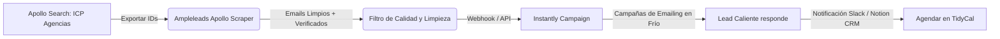

# Plan de Ejecución Outbound, SEO e Inbound — Riqueza Digital

> **Fecha:** 2026-06-02  
> **Estado:** Listo para Implementación Técnica  
> **Autor:** Antigravity (AI Pair Partner)  
> **Para:** Kevin Berbel (Fundador)  
> **Objetivo:** Definir el sistema de scraping y automatización de leads en frío (Apollo + Instantly), redactar la secuencia completa de cold mailing, establecer el plan SEO y escribir el guion de vídeo "Caso Meta" hablando a cámara.

---

## 1. Plan de Captación de Leads Automatizado (Apollo + Scraper + Instantly)

Este es el sistema validado de mayor conversión actual para captar agencias B2B de forma masiva y predecible.



### Paso A: Búsqueda y Filtrado en Apollo (Tu ICP exacto)
Configura estos filtros en Apollo.io para encontrar a tus decisores:
*   **Sector (Industry):** "Advertising Services", "Marketing Services", "Software Development" (desarrollo boutique).
*   **Tamaño de Empresa (Employee Count):** De 5 a 50 empleados (evita freelancers y empresas con comités lentos).
*   **Puestos de Decisión (Job Titles):** `CEO`, `Founder`, `Co-Founder`, `Director of Operations`, `COO`, `Head of Delivery`.
*   **Ubicación (Geography):** España (Fase 1) e Hispanoamérica (Fase 2).

### Paso B: Scraping y Limpieza con Ampleleads
1.  Usa [Ampleleads Apollo Scraper](https://app.ampleleads.io/apollo-scraper) para extraer los correos electrónicos corporativos directos de tu búsqueda de Apollo de manera económica y masiva.
2.  **IMPORTANTE (Higiene del dominio):** Antes de enviar nada a Instantly, limpia la lista con un verificador (ej. MillionVerifier o el propio validador interno de Instantly). Si tu tasa de rebote (bounce rate) supera el 3%, tus correos irán a la carpeta de SPAM.

### Paso C: Conexión vía API a Instantly
1.  Crearemos un flujo en tu **n8n** (que tienes hosteado en Hostinger) para sincronizar los leads validados de Ampleleads a Instantly de forma automática.
2.  El flujo de n8n tomará el CSV de Ampleleads, filtrará duplicados contra tu Notion CRM, y usará la API de Instantly (`POST /v1/lead/add`) para inyectarlos en la secuencia correspondiente.

---

## 2. Secuencia Completa de Cold Mailing (3 Emails)

Esta secuencia explota el gatillo psicológico del **"CEO-to-BD Forward"** (El Reenvío del CEO) adaptada a tu valor añadido y precios.

### Correo 1: El Reenvío Interno (El Hook)
*   **Remitente:** Tu comercial o asistente virtual (ej. `soporte@riquezadigital.es` o un alias comercial).
*   **Asunto:** [Nombre del Comercial] de parte de Kevin de Riqueza Digital (contacto para [Nombre del Lead])
*   **Cuerpo:**

```text
Hola [Nombre del Lead],

Kevin, nuestro director general, me pidió que te contactara directamente. Te reenvío abajo el correo que me mandó esta mañana y te dejo su calendario de reservas por si te cuadra una breve videollamada de 10 minutos para evaluar si vuestro equipo está expuesto:

👉 [Link de TidyCal de Kevin]

Un saludo,
[Nombre del Comercial]
Desarrollo de Negocio | Riqueza Digital
---

---------- Mensaje reenviado ----------
De: Kevin Berbel <kevin@riquezadigital.es>
Para: [Nombre del Comercial]
Asunto: Revisar protocolos de datos y seguridad en [Nombre de su Agencia] por favor

[Nombre del Comercial],

Estuve revisando el perfil de [Nombre del Lead], socio en [Nombre de su Agencia]. Por el volumen de campañas y creativos que gestionan, es casi seguro que sus copys y media buyers están usando cuentas personales de ChatGPT para redactar copys e introducir datos confidenciales de clientes. 

Esto es un problema grave de gobernanza de datos que les puede costar un cliente si hay una fuga o si infringen políticas de compliance. 

Ponte en contacto con [Nombre del Lead] y ofrécele hacer una auditoría rápida de 10 minutos para mostrarle cómo configurar Claude Team de forma segura y cómo podemos blindar sus datos (con APIs que no entrenan modelos). Si ven que les aporta certeza, podemos ayudarles a implementar su propio ecosistema de automatización.

Si te responde me avisas.

Kevin Berbel
Fundador | Riqueza Digital
```

---

### Correo 2: El Seguimiento de Valor (4 días después)
*   **Remitente:** [Nombre del Comercial]
*   **Asunto:** Re: [Nombre del Comercial] de parte de Kevin de Riqueza Digital
*   **Cuerpo:**

```text
Hola [Nombre del Lead], 

Sé que estarás a mil con la agencia. Te dejo por aquí un diagrama rápido de cómo automatizamos internamente el delivery de nuestros proyectos de IA para clientes usando nuestro propio organismo agéntico:

🔗 [Enlace a un mini-video de 1 min en la web o un PDF explicativo corto]

Con esta misma estructura ayudamos a agencias similares a la tuya a multiplicar x5 la productividad operativa de sus redactores y analistas, reduciendo el trabajo manual a cero. 

¿Te cuadra que lo comentemos brevemente el [Día de la semana siguiente] a las [Hora, ej: 10:00h]?

Un saludo,
[Nombre del Comercial]
```

---

### Correo 3: El Cierre Directo (3 días después)
*   **Remitente:** Kevin Berbel (Directamente)
*   **Asunto:** [Nombre del Lead] - Pregunta rápida sobre la IA de tu equipo
*   **Cuerpo:**

```text
Hola [Nombre del Lead],

Soy Kevin. Te escribo yo directamente porque mi compañero [Nombre del Comercial] me comentó que te había enviado un par de correos sobre seguridad y automatización con IA.

Sé perfectamente lo que es dirigir una agencia y no tener tiempo para historias. Te hago una pregunta muy directa de negocio: 

¿Te interesaría ver cómo podemos liberar hasta 8 horas semanales por empleado en tu equipo de performance con un plan sencillo de implementación, garantizado por contrato? Si no lo conseguimos en 30 días, no pagas nada.

Si te interesa la idea, responde "OK" a este email y te paso un par de huecos. Si no, ningún problema y disculpa la molestia.

Un saludo,

Kevin Berbel
Fundador | Riqueza Digital
```

---

## 3. Plan SEO de Alta Intención (Gobernanza + Claude)

En lugar de competir con grandes agencias en keywords de alto volumen y nula conversión, atacaremos keywords transaccionales e informacionales donde el CEO o el Director de Operaciones (COO) busca **soluciones a problemas reales**.

### Estructura de Contenidos Web (`riquezadigital.es/blog`)

#### Hub 1: Seguridad y Gobernanza de Datos (Compliance)
*   **Artículo 1:** *"Guía completa de Gobernanza de IA para Agencias de Marketing (Evita fugas de datos)"*.
    *   *Foco:* Explicar la diferencia entre ChatGPT Plus (público) y ChatGPT Enterprise / Claude Team (seguro).
*   **Artículo 2:** *"¿Entrena OpenAI con tus datos? Cómo usar la API de forma segura y confidencial"*.
    *   *Foco:* Explicar a los directores de IT cómo las APIs garantizan privacidad.

#### Hub 2: Claude como el estándar del sector
*   **Artículo 1:** *"Claude Team vs ChatGPT Team: Por qué los programadores y redactores de agencias prefieren Anthropic"*.
    *   *Foco:* Posicionarte como referente de Claude (un nicho menos saturado que ChatGPT).
*   **Artículo 2:** *"Cómo implementar Claude en tu empresa paso a paso (Sin riesgos de compliance)"*.

#### Hub 3: Automatización Operativa y Casos de Éxito B2B
*   **Artículo 1:** *"Cómo automatizar el onboarding de clientes en una agencia con n8n y Notion"*.
    *   *Foco:* Mostrar el "Caso Meta" (tu propio sistema) paso a paso.
*   **Artículo 2:** *"Automatizar reportes de Meta Ads con IA: Cómo ahorrar 15 horas al mes por cliente"*.

---

## 4. Guion del Vídeo "Caso Meta" (Hablando a Cámara)

Este guion está diseñado para grabarse en vídeo vertical (Reel/LinkedIn Video) de unos 60-70 segundos. El tono es de "bar", cercano, directo y ultra-honesto.

*   **Formato:** Kevin sentado, Rode inalámbrico puesto, hablando relajado a cámara.
*   **Duración:** ~60 segundos.

| Parte | Visual / Acción | Guion Hablado |
| :--- | :--- | :--- |
| **Hook (0-5s)** | *Kevin mira a cámara de forma directa, tal vez con un portátil abierto al lado.* | "El 95% de las agencias que dicen vender 'soluciones de IA' no usan IA para operar su propio negocio." |
| **Problema (5-20s)** | *Gesticulando, tono conversacional, sin rodeos.* | "Te venden cursos de prompts enlatados que sacaron de un vídeo de YouTube de hace tres meses. Pero cuando entras a ver sus operaciones internas... todo es manual. Tienen a un media buyer picando datos de Excel y a un copywriter copiando y pegando textos a mano en ChatGPT." |
| **Solución / Prueba (20-40s)** | *Señala hacia la pantalla o muestra un flash rápido de un flujo de n8n/Notion.* | "En Riqueza Digital decidimos hacer lo contrario. Operamos como un organismo agéntico. Todo nuestro marketing, la captación de leads en frío y el onboarding de clientes se gestiona a través de agentes e integraciones seguras de Claude y n8n. No enseñamos teoría, enseñamos lo que nos da de comer a diario." |
| **Beneficio (40-50s)** | *Tono con autoridad, hablando de claridad.* | "Vuelvo a lo importante: no vendemos humo de productividad infinita. Vendemos claridad y certeza. Si quieres que entremos en tu agencia, pongamos orden y multipliquemos x5 la velocidad de tu equipo con seguridad y gobernanza..." |
| **CTA (50-60s)** | *Señalando abajo o invitando a comentar.* | "...escríbeme 'ORGANISMO' en los comentarios y te paso un vídeo de 2 minutos donde te enseño nuestra arquitectura por dentro. Así de simple." |

---

## 5. Checklist de APIs e Infraestructura para la Autonomía

Para que el agente pueda trabajar en la implementación del flujo de leads y SEO de forma autónoma, necesitaremos configurar y documentar los accesos de las siguientes plataformas:

1.  **Instantly API Key:**
    *   *Uso:* Permite agregar leads automáticamente a las campañas a través de n8n.
    *   *Dónde obtenerla:* Instantly.ai -> Settings -> Integrations -> API Keys.
2.  **Apollo Scraper / Ampleleads Token:**
    *   *Uso:* Para automatizar el enriquecimiento de leads si se integra directamente.
    *   *Dónde guardarlo:* En las variables de entorno de Windows (ver [proximos-pasos-brief-v1.md](file:///c:/Users/kein-/OneDrive/Desktop/Riqueza%20Digital/agencia/marketing/strategy/proximos-pasos-brief-v1.md#L38-L46)).
3.  **n8n Webhook / Credenciales:**
    *   *Uso:* Para conectar el scraper a Instantly y registrar respuestas calientes en el CRM de Notion.
    *   *Dónde encontrarlo:* Configuración de tu instancia n8n en Hostinger.
