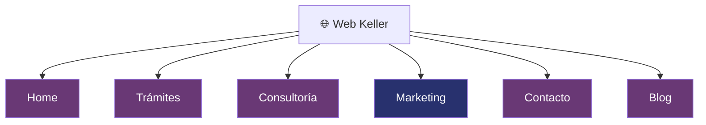

# Diseño Web Keller — Home Page + Estructura del Sitio

Crear el mockup completo de la Home de Keller en HTML/CSS/JS como paso previo a su traslado a WordPress. Definir el sistema de diseño visual basado en el **manual de marca oficial** (paleta púrpura/navy/malva).

## User Review Required

> [!IMPORTANT]
> **Tipografía del logo:** El logo usa una tipografía serif con interletraje amplio para "KELLER". ¿Sabes cuál es la fuente exacta? Si no, usaré **Cormorant Garamond** (Google Fonts) que tiene un estilo muy similar — serif elegante con interletraje amplio.

> [!IMPORTANT]
> **Fotos de Valentina:** Confirmadas pero aún no recibidas. Generaré imágenes placeholder que capturen la estética cinematográfica del brief. Cuando las tengas, compártelas para integrarlas.

---

## Estructura de Páginas (Corregida)

**6 páginas totales** — los sub-servicios son secciones de contenido dentro de cada página, no sub-páginas:



| Página | Contenido interior (secciones, NO sub-páginas) |
|--------|------------------------------------------------|
| **Home** | Hero, problema, posicionamiento, servicios, paquetes, cita, CTA, footer |
| **Trámites** | Formalización empresarial · Registro de marca (+ búsqueda antecedentes) · Patentes · Trámites ante la SIC |
| **Consultoría** | Derechos de autor · Propiedad intelectual · Construcción de empresa · Contratos · Blindaje empresarial |
| **Marketing** | Meta Ads 🔵 · Google Ads 🔵 · Asesoría financiera 🔵 · Naming 🔵 · Branding 🔵 |
| **Contacto** | Formulario / CTA WhatsApp / diagnóstico gratuito |
| **Blog** | Artículos — pilares de contenido: Conexión, Storytelling, Posicionamiento, Venta |

🟡 = Valentina ejecuta directamente | 🔵 = Delegado a colaboradores

---

## Sistema de Diseño — Keller Design Tokens (Manual de Marca Oficial)

### Paleta de Colores

Extraída directamente del manual de marca recibido:

| Token | Hex | RGB | Uso |
|-------|-----|-----|-----|
| `--keller-gray` | `#606060` | 96, 96, 96 | Texto secundario, fondos neutros, metadata |
| `--keller-plum` | `#693875` | 105, 56, 117 | **Color primario.** Acentos, botones, headings, logo |
| `--keller-mauve` | `#CDABCE` | 205, 171, 206 | Fondos suaves, highlights, hover states |
| `--keller-navy` | `#28316E` | 40, 49, 110 | Fondos premium, secciones oscuras, contraste profundo |
| `--keller-blush` | `#F1E6EF` | 241, 230, 239 | Fondos claros, secciones alternas, cards |
| `--keller-lavender` | `#D8E2ED` | 216, 226, 237 | Fondos secundarios claros, secciones complementarias |
| `--keller-white` | `#FAFAF8` | 250, 250, 248 | Fondo base, limpieza visual |
| `--keller-dark` | `#1A1A2E` | 26, 26, 46 | Texto principal, fondos hero (navy ultra oscuro) |

### Gradientes Clave

```css
/* Hero / Secciones premium */
--gradient-royal: linear-gradient(135deg, #28316E 0%, #693875 100%);

/* Fondos suaves */
--gradient-soft: linear-gradient(180deg, #F1E6EF 0%, #FAFAF8 100%);

/* Accent sutil */
--gradient-mauve: linear-gradient(135deg, #CDABCE 0%, #D8E2ED 100%);
```

### Tipografías

| Rol | Fuente | Peso | Uso |
|-----|--------|------|-----|
| **Display / Títulos** | Cormorant Garamond | 300, 400, 600 | H1, H2, hero statements, tagline |
| **Body / UI** | Inter | 300, 400, 500 | Párrafos, botones, navegación |
| **Accent / Citas** | Cormorant Garamond Italic | 300 | Citas, reflexiones, taglines |

> Nota: se reemplazarán si el usuario confirma la fuente oficial del logo.

### Componentes Clave

| Componente | Estilo |
|-----------|--------|
| **Botones primarios** | Fondo `--keller-plum`, texto blanco, border-radius 2px, hover con luminosidad |
| **Botones secundarios** | Borde fino `--keller-plum`, fondo transparente, hover fill suave |
| **Separadores** | Líneas 1px `--keller-mauve`, opacidad 40% |
| **Cards** | Fondo `--keller-blush`, borde sutil `--keller-mauve`, hover con elevación mínima |
| **Cards premium** | Fondo `--keller-navy`, texto blanco, borde `--keller-mauve` |
| **Logo** | Rosa SVG + "KELLER" interletraje 0.3em + tagline en caps |

---

## Secciones de la Home Page

### 1. 🔝 Navbar

- Logo Keller (rosa + nombre) a la izquierda
- Menú: Home · Trámites · Consultoría · Marketing · Blog · Contacto
- CTA: botón "Diagnóstico Gratuito" → WhatsApp
- Fondo transparente que transiciona a blanco con sombra sutil al scroll
- Transición suave 0.3s

### 2. 🎬 Hero Section

- Full viewport
- Fondo: gradiente navy → plum (`--gradient-royal`)
- Rosa del logo como elemento decorativo semitransparente de fondo (watermark sutil)
- Headline serif grande: *"Construimos legados. Protegemos imperios."*
- Subtítulo con interletraje amplio en `--keller-mauve`
- CTA principal → WhatsApp diagnóstico gratuito (botón blanco con hover mauve)
- Animación fade-in + translate suave al cargar

### 3. 🔥 Sección Problema / Tensión

- Fondo `--keller-blush` (rosa claro)
- Frases de dolor del buyer persona en tipografía serif display:
  - *"¿Estás creciendo sin protección?"*
  - *"¿Improvisando tu estructura legal?"*
- Estilo editorial: texto centrado, interletraje amplio, ritmo visual pausado
- Scroll reveal con fade-in escalonado

### 4. 💎 Qué es Keller / Posicionamiento

- Fondo blanco
- Layout dos columnas: imagen de Valentina (placeholder) + texto
- Línea vertical decorativa en `--keller-plum` separando las columnas
- Headline: *"No somos una firma jurídica fría. Somos tu aliado estratégico."*
- Texto de posicionamiento desde el brief
- Parallax sutil en la imagen

### 5. ⚡ Servicios

- Fondo `--keller-navy` (sección oscura premium)
- 3 cards principales: **Trámites** · **Consultoría** · **Marketing**
- Cada card con:
  - Icono/ilustración minimalista en `--keller-mauve`
  - Título en blanco
  - Lista de sub-servicios en `--keller-lavender`
  - Enlace "Conocer más →" que lleva a la página correspondiente
- Hover: borde `--keller-plum` iluminado + micro-elevación

### 6. 📦 Paquetes (IDEA / SEMILLA / SERIES A)

- Fondo gradiente suave (`--gradient-soft`)
- 3 columnas con diseño de pricing elegante
- Cada paquete:
  - Nombre en serif display
  - "Para quién" en texto body
  - Lista de incluidos con checkmarks en `--keller-plum`
  - Mensaje/tagline en itálica
  - CTA → WhatsApp
- Paquete central (SEMILLA) destacado con fondo `--keller-plum` y texto blanco

### 7. 💬 Sección de Cita / Reflexión

- Full width, fondo `--keller-navy`
- Frase centrada en serif display grande, color `--keller-mauve`:
  > *"El verdadero poder rara vez hace ruido."*
- Rosa del logo como watermark decorativo
- Efecto: letras que se revelan suavemente al hacer scroll

### 8. 📞 CTA Final — Diagnóstico Gratuito

- Fondo `--keller-blush`
- Headline: *"Tu empresa merece algo más que improvisación."*
- Subtítulo: *"Agenda tu diagnóstico gratuito y descubre cómo proteger tu visión."*
- Botón prominente `--keller-plum` → WhatsApp
- Diseño centrado, minimalista

### 9. 🦶 Footer

- Fondo `--keller-dark` (navy ultra oscuro)
- Logo Keller en blanco/mauve
- Columnas: Links de páginas · Servicios · Contacto (email + WhatsApp)
- Frase de cierre: *"Keller — Empieza a crecer."*
- Redes sociales (si las tiene)
- Copyright

---

## Propuesta de Interactividad

Quiet luxury — elegante sin excesos:

| Efecto | Dónde | Detalles |
|--------|-------|----------|
| **Scroll reveal** | Todas las secciones | IntersectionObserver + CSS: fade-in + translate-up 20px, 0.6s ease |
| **Navbar morph** | Header | Transparente → blanco con shadow al pasar 80px scroll |
| **Parallax sutil** | Imagen de Valentina (sección 4) | Factor 0.3, transform translateY |
| **Hover glow** | Cards servicios y paquetes | Box-shadow púrpura + border-color transition |
| **Text reveal** | Sección cita (7) | Clip-path o opacity reveal con scroll progress |
| **Staggered fade** | Sección problema (3) | Cada frase aparece con 200ms de delay |
| **Button hover** | Todos los CTAs | Background brightness + subtle scale 1.02 |
| **Rose watermark** | Hero + Cita | Opacidad 5%, posición absoluta, no interfiere |

---

## Proposed Changes

### Fase 0: Registro de cliente ✅ Completado

#### [NEW] [profile.md](file:///c:/Users/kein-/OneDrive/Desktop/Riqueza%20Digital/clients/keller-valentina/profile.md)
Perfil completo actualizado con paleta de colores real del manual de marca.

#### [MODIFY] [CLAUDE.md](file:///c:/Users/kein-/OneDrive/Desktop/Riqueza%20Digital/CLAUDE.md)
Keller añadida a la tabla de clientes.

---

### Fase 1: Mockup Home (HTML/CSS/JS)

#### [NEW] `clients/keller-valentina/web/index.html`
Página completa de la Home con las 9 secciones definidas arriba. HTML5 semántico, SEO-ready, con logo SVG inline.

#### [NEW] `clients/keller-valentina/web/styles.css`
Design system completo:
- CSS custom properties (tokens de color, tipografía, espaciado)
- Layout responsive (mobile 375px → tablet 768px → desktop 1440px)
- Componentes (navbar, cards, pricing, buttons, footer)
- Animaciones CSS (reveal, hover, transitions)

#### [NEW] `clients/keller-valentina/web/script.js`
JavaScript vanilla (~80 líneas):
- Scroll reveal con IntersectionObserver
- Navbar morph on scroll
- Text reveal en sección cita
- Smooth scroll para links internos

#### [NEW] `clients/keller-valentina/web/assets/`
- Logo Keller recreado en SVG (rosa + texto)
- Imágenes placeholder generadas con IA para Valentina/despacho
- Iconos minimalistas para servicios

---

## Open Questions

> [!IMPORTANT]
> **Tipografía:** ¿Sabes qué fuente usa el logo de Keller? La serif del "KELLER" en el manual parece una **Cormorant** o **Libre Caslon**. Si no la conoces, usaré Cormorant Garamond que es la más cercana visualmente.

> [!NOTE]
> **Fotos:** Cuando tengas las fotos de Valentina, compártelas. ¿De qué tipo son? (retrato formal, trabajando, lifestyle, con equipo...)

> [!NOTE]
> **Marketing en la web:** Los servicios de Marketing (Meta Ads, Google Ads, etc.) son delegados a colaboradores. ¿Quieres que aparezcan como servicios propios de Keller o con un enfoque diferente (ej. "Alianzas estratégicas", "Red de especialistas")?

> [!NOTE]
> **Blog:** ¿Tiene ya contenido publicado o empezamos con la estructura vacía?

---

## Verification Plan

### Visual Review
- Abrir `index.html` en navegador para revisar el mockup completo
- Verificar responsive en 3 breakpoints: 375px, 768px, 1440px
- Validar que los colores coinciden exactamente con el manual de marca
- Comprobar animaciones y hover states

### Funcional
- Verificar enlace WhatsApp: `https://wa.me/573058811119?text=Hola%20Valentina...`
- Comprobar navegación smooth scroll
- Validar HTML con W3C validator
- Lighthouse audit (rendimiento + SEO)

### Aprobación
- Presentar mockup al usuario para feedback visual
- Iterar hasta aprobación
- Trasladar a WordPress como Fase 2
