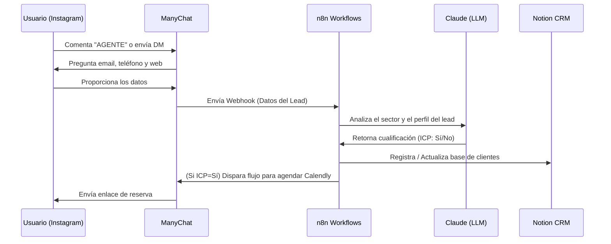

# Guía de Integración ManyChat + n8n + Notion — Riqueza Digital

Este documento describe la arquitectura técnica y los pasos de configuración para el sistema automático de captación y cualificación de leads de la agencia.

---

## 1. Flujo de Datos General



---

## 2. Configuración en ManyChat

### A. Disparador (Trigger)
1. Ve a **Automation -> Flows** y crea un nuevo flujo.
2. Añade un disparador de tipo **Instagram User Comments on your Post or Reel** o **Instagram DM keyword**.
3. Configura la palabra clave (ej. `AGENTE` o `AUDITORIA`).

### B. Preguntas y Captura de Datos
1. Usa bloques **User Input** para pedir la información:
   - *"¡Hola! Para enviarte la plantilla, ¿a qué correo te la mando?"* -> Guardar en el campo de sistema `Email`.
   - *"¿Cuál es la página web de tu negocio?"* -> Guardar en un campo personalizado (User Field) llamado `Web_Cliente`.
   - *"¿Qué servicio o producto vendes principalmente?"* -> Guardar en `Nicho_Cliente`.

### C. Acción de Webhook (External Request)
Una vez capturados los datos, añade un bloque de tipo **Action -> External Request**:
- **Método**: `POST`
- **URL**: URL del webhook de producción generado en tu trigger de n8n (ej. `https://n8n.tudominio.com/webhook/manychat-lead`).
- **Headers**: `Content-Type: application/json`
- **Body** (JSON):
  ```json
  {
    "first_name": "{{user_first_name}}",
    "last_name": "{{user_last_name}}",
    "instagram_username": "{{user_instagram_username}}",
    "email": "{{user_email}}",
    "web": "{{user_custom_field_Web_Cliente}}",
    "nicho": "{{user_custom_field_Nicho_Cliente}}",
    "manychat_user_id": "{{user_id}}"
  }
  ```

---

## 3. Configuración del Workflow en n8n

El flujo de trabajo en n8n debe constar de los siguientes nodos:

### Nodo 1: Webhook Trigger
- **Path**: `manychat-lead`
- **HTTP Method**: `POST`
- **Response Mode**: `Immediately` (retorna un código 200 rápido a ManyChat para evitar timeouts).

### Nodo 2: OpenAI / Anthropic Node (Cualificación por IA)
- **Model**: `gpt-4o-mini` o `claude-3-5-sonnet`
- **Prompt**:
  ```text
  Analiza la siguiente información de un nuevo lead que ha interactuado en nuestro Instagram:
  - Nombre: {{ $json.first_name }}
  - Web: {{ $json.web }}
  - Descripción de lo que vende: {{ $json.nicho }}
  
  Determina si este cliente se ajusta a nuestro perfil de cliente ideal (ICP):
  - ICP de Riqueza Digital: Negocios que venden servicios B2B, consultoras, formadores, agencias o e-commerce que facturen y tengan necesidad de optimizar sus anuncios de Google/Meta o automatizar sus procesos de CRM/n8n.
  
  Retorna un objeto JSON estructurado con:
  1. "es_valido": true/false
  2. "nicho_detectado": "...",
  3. "comentario": "Breve explicación de 1 línea de por qué califica o no."
  ```

### Nodo 3: Notion Node (Escritura en Base de Datos)
- **Database**: Tabla de clientes (`d05e051090c04c5d80bf14bebade5a5e`)
- **Acción**: `Create a database item`
- **Campos a mapear**:
  - `Nombre`: `{{ $json.first_name }} {{ $json.last_name }}`
  - `Email`: `{{ $json.email }}`
  - `Web`: `{{ $json.web }}`
  - `Plataformas`: `Meta Ads`
  - `Notas / Comentarios`: `Cualificación IA: {{ $json.comentario }}`
  - `Estado`: `Prospecto`

### Nodo 4: Condicional (IF) e Integración de Retorno (Opcional)
- Si `es_valido` es `true`:
  - Llama a la API de ManyChat (`POST /fb/subscriber/sendFlow`) usando el ID del usuario (`manychat_user_id`) para disparar un segundo flujo en ManyChat que le envíe el enlace de Calendly de forma proactiva.
